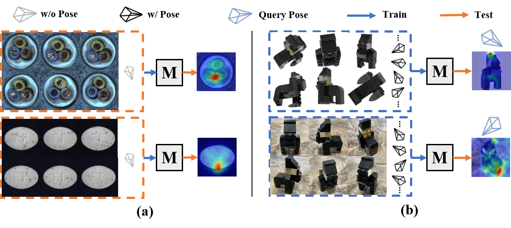
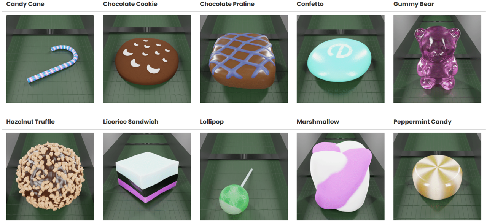
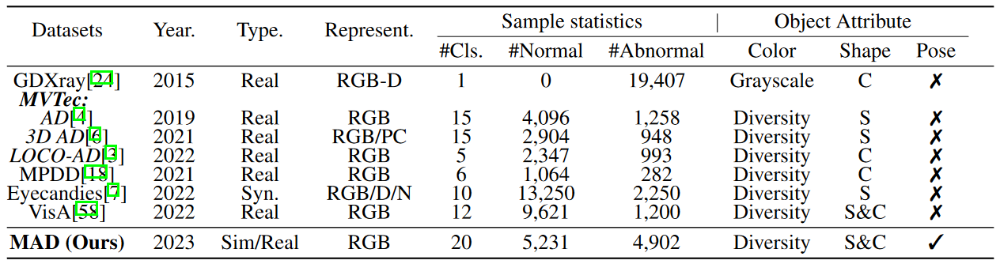
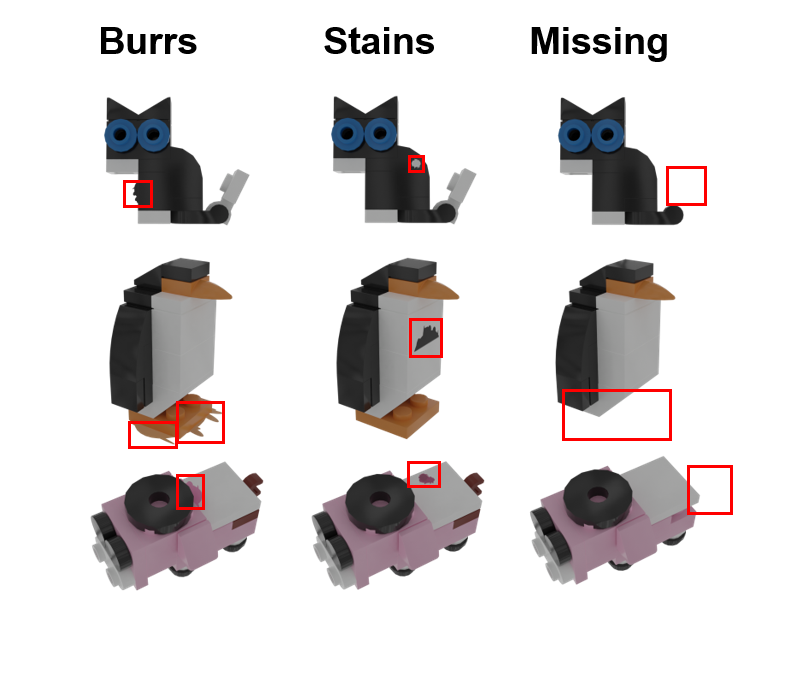
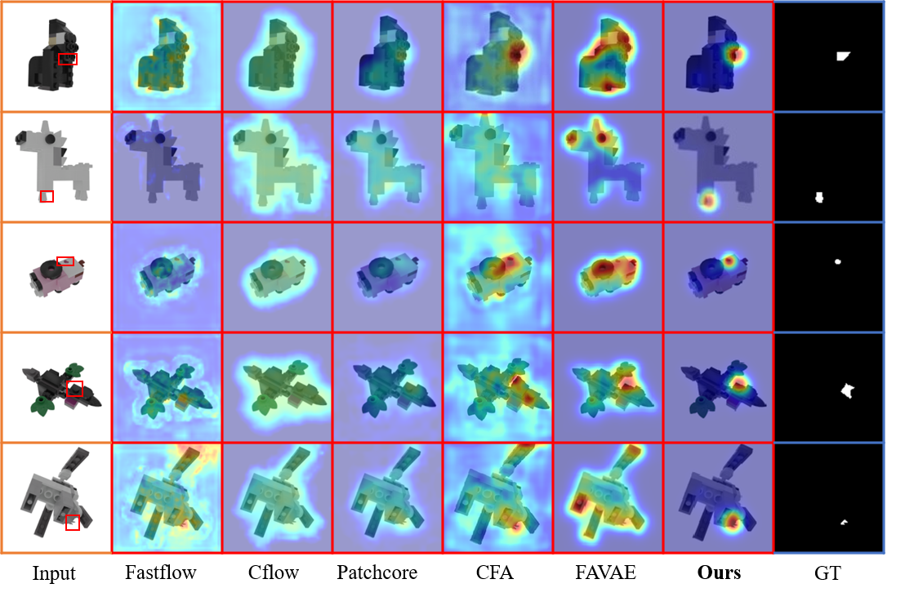
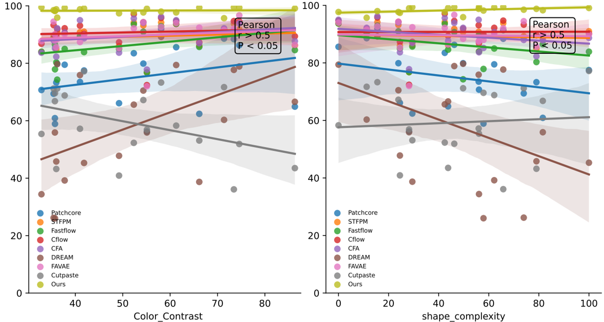
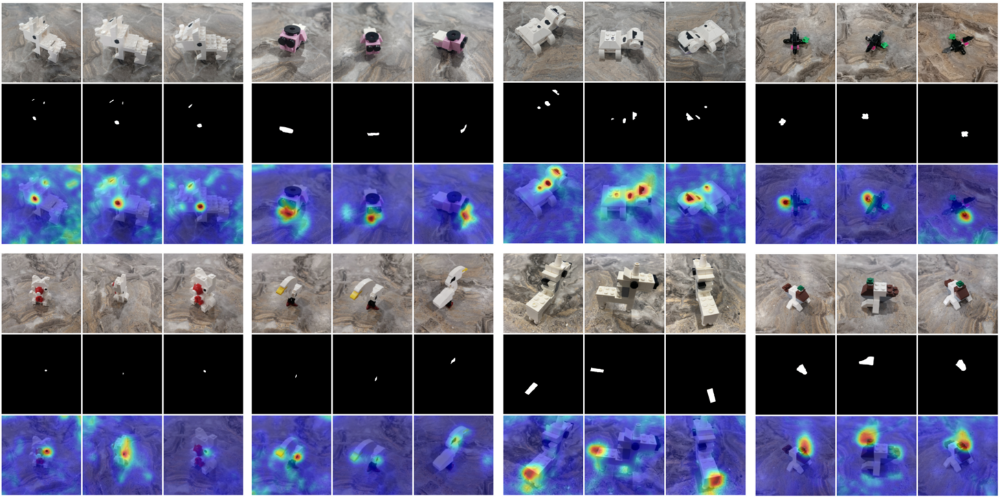
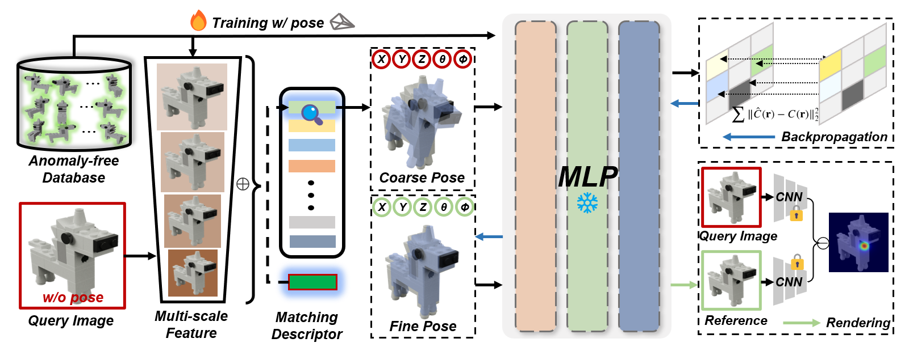

# [NeurlPS 2023] PAD: A Dataset and Benchmark for Pose-agnostic Anomaly Detection
This repository provides the official PyTorch implementation code, data and models of the following paper:  
**PAD: A Dataset and Benchmark for Pose-agnostic Anomaly Detection**<br>
[[arXiv]](https://arxiv.org/abs/2310.07716) 丨 [Code]
> [Qiang Zhou](https://scholar.google.com/citations?user=CMYTxUEAAAAJ&hl=en)* (AIR), [Weize Li](https://ericlee0224.github.io/)* (AIR), [Lihan Jiang](https://jianglh-whu.github.io/)  (WHU), [Guoliang Wang](https://github.com/Cross-ZBuild) (AIR)   
> [Guyue Zhou](https://air.tsinghua.edu.cn/en/info/1046/1196.htm) (AIR), [Shanghang Zhang](https://www.shanghangzhang.com/) (PKU), [Hao Zhao](https://sites.google.com/view/fromandto) (AIR). <br>
> 1 AIR, Tsinghua University, 2 Wuhan University, 3 Peking University.

**Abstract:** 
*Object anomaly detection is an important problem in the field of machine vision and has seen remarkable progress recently. However, two significant challenges hinder its research and application. First, existing datasets lack comprehensive visual information from various pose angles. They usually have an unrealistic assumption that the anomaly-free training dataset is pose-aligned, and the testing samples have the same pose as the training data. However, in practice, anomaly can come from different poses and training and test samples may have different poses, calling for the study on pose-agnostic anomaly detection. Second, the absence of a consensus on experimental settings for pose-agnostic anomaly detection leads to unfair comparisons of different methods, hindering the research on pose-agnostic anomaly detection. To address these issues, we introduce Multi-pose Anomaly Detection (MAD) dataset and Pose-agnostic Anomaly Detection (PAD) benchmark, which takes the first step to address the pose-agnostic anomaly detection problem. Specifically, we build MAD using 20 complex-shaped LEGO toys including 4k views with various poses, and high-quality and diverse 3D anomalies in both simulated and real environments. Additionally, we develop the OmniposeAD, trained using MAD, specifically designed for pose-agnostic anomaly detection. Through comprehensive evaluations, we demonstrate the superiority of our dataset and framework. Furthermore, we provide an open-source benchmark library, including dataset and baseline methods that cover 8 anomaly detection paradigms, to facilitate future research and application in this domain. Our code, data, and models will be publicly available at https://github.com/EricLee0224/PAD.*<br>

<p align="center">
  
</p>

The main contributions are summarized as follows: 

- We introduced **P**ose-agnostic **A**nomaly **D**etection (PAD), a novel setting for object anomaly detection from diverse viewpoints/poses, breaking free from the constraints of stereotypical pose alignment, and taking step forward to pratical anomaly detection and localization tasks.    
- We developed the **M**ulti-pose **A**nomaly **D**etection (MAD) dataset, the first attempt at evaluating the pose-agnostic anomaly detection. Our dataset comprises MAD-Sim and MAD-Real, containing 11,000+ high-resolution RGB images of multi-pose views from 20 diverse shapes and colors of LEGO toys, offering pixel-precise ground truth for 3 types of anomalies.   
- We conducted a comprehensive benchmarking of the PAD setting, utilizing the MAD dataset. Across 8 distinct paradigms, we meticulously selected 10 state-of-the-art methods for evaluation. In a pioneering effort, we delving into the previously unexplored realm of correlation between object attributes and anomaly detection performance.   
- We proposed ***OmniposeAD***, utilizing NeRF to encode anomaly-free object attributes from diverse viewpoints/poses and comparing reconstructed normal reference with query image for pose-agnostic anomaly detection and localization. It outperforms previous methods quantitatively and qualitatively on the MAD benchmark, which indicates the promising potential on PAD setting.    
---
## 1. Pose-agnostic Anomaly Detection Setting
The progress of object anomaly detection in industrial vision is significantly impeded by the scarcity of datasets containing high-quality annotated anomaly samples and comprehensive view information about normal objects. Our Pose-agnostic Anomaly Detection (PAD) setting introduced for object anomaly detection and localization tasks shown as below and it can be formally stated as follows:   

Given a training set $\mathcal{T}=\{t_{i}\}_{i=1}^{N}$, in which $\{t_1, t_2, \cdots, t_N\}$ are the anomaly-free samples from object's multi-pose view and each sample $t$ consists of an RGB image $I_{\text{rgb}}$ with pose information $\theta_{\text{pose}}$. In addition, $\mathcal{T}$ belongs to a certain object $o_{j}$, $o_{j}\in\mathcal{O}$, where $\mathcal{O}$ denotes the set of all object categories. During testing, given a query (normal or abnormal) image $\mathcal{Q}$ from object $o_{j}$ without pose information $\theta_{\text{pose}}$, the pre-trained AD model $M$ should discriminate whether or not the query image $\mathcal{Q}$ is anomalous and localize the pixel-wise anomaly region if the anomaly is detected.

<p align="center">
  
</p>

**MVTec** has developed a series of widely-used photo-realistic industrial anomaly detection dataset (**Note that all screenshots from MVTec.**):   
However, the objects provided by the [**MVTec-AD**](https://www.mvtec.com/company/research/datasets/mvtec-ad) dataset are **overly simplistic**, as discerning anomalies can be achieved solely from a single view. 

<p align="center">
  
</p>

Although the [**MVTec 3D-AD**](https://www.mvtec.com/company/research/datasets/mvtec-3d-ad) dataset offers more complex objects, it **lacks RGB information from a full range of views**, requiring the supplementation of **hard-to-capture point cloud data** to detect invisible structural anomalies. 

<p align="center">
  
</p>

The [**MVTec-LOCO AD**](https://www.mvtec.com/company/research/datasets/mvtec-loco) dataset provides rich global structural and logical information but is **not suitable for fine-grained anomaly detection on individual objects**.

<p align="center">
  
</p>

[**GDXray**](https://github.com/computervision-xray-testing/GDXray) dataset provides grayscale maps obtained through X-ray scans for visual discrimination of structural defects but **lacks normal samples and color/texture information**.

The [**MPDD**](https://ieeexplore.ieee.org/document/9631567) dataset offers multi-angle information about the objects but is **limited in dataset sample size and lacks standardized backgrounds** in the photos.

Recently, [**Eyecandies**](https://eyecan-ai.github.io/eyecandies/) dataset has introduced a substantial collection of synthetic candy views captured under various lighting conditions and provides multimodal object information. However, there **remains a significant gap between laboratory-synthesized data and the real or simulated data domain**.

<p align="center">
  
</p>

To address these issues and enable exploration of the pose-agnostic AD problem, we propose our dataset. As the table shown below, we present a comprehensive comparison between MAD and other representative object anomaly detection datasets.
<p align="center">
  
</p>

---
## 2. MAD: Multi-pose Anomaly Detection Dataset

<p align="center">
  
</p>  

We introduce a dataset, the **M**ulti-pose **A**nomaly **D**etection (MAD) dataset, which represents the first attempt to evaluate the performance of pose-agnostic anomaly detection. The MAD dataset containing 4,000+ highresolution multi-pose views RGB images with camera/pose information of 20 shape-complexed LEGO animal toys for training, as well as 7,000+ simulation and real-world collected RGB images (without camera/pose information)  with pixel-precise ground truth annotations for three types of anomalies in test sets. Note that MAD has been further divided into MAD-Sim and MAD-Real for simulation-to-reality studies to bridge the gap between academic research and the demands of industrial manufacturing. 

### 2.1 Meet ours 20 toys
<p align="center">
  
</p>

### 2.2 Defect types and samples
When creating data with defects, our work referred to several common types of defects on the LEGO production line, and selected 'Stains', 'Burrs', and 'Missing' as the main defect categories for the dataset.  
**Burrs**  are small, unwanted projections or rough edges that can form on the surface of LEGO bricks or components.   
**Stains** refer to discoloration or marks that appear on the surface of LEGO bricks or components.   
**Missing** parts refer to situations where LEGO bricks or components are not included in the final packaged set as intended.   

<p align="center">
  
</p>
* Please see more details in our supplementary materials.

### 2.3 MAD-Simulated Dataset
We obtained a collection of open-source LEGO models by visiting the LEGO community. These models were constructed using parts from the Ldraw library, which is a basic LEGO parts library, and they showcased various small animal figures. In order to meet the requirements of the experiment, the author made precise adjustments and optimizations to the models' details, such as edges and colors.

To generate the necessary data, we utilized Blender software and imported the required Ldraw parts. They then adjusted the angles and lighting of the models to achieve the best visual effects. To ensure a more comprehensive 3D dataset, the author employed a 360-degree surround camera technique to render the models from multiple angles.

For camera placement, the author used a circular surface centered on the vertex of the Z-axis as a reference. They positioned a camera every 15 degrees along this circular surface and added cameras at equal intervals along the Z-axis. This setup enabled multiple cameras to render simultaneously, resulting in a richer and more comprehensive dataset with multi-angle model data.

**MAD-Sim Dataset (972M)**: [Google Drive](https://drive.google.com/file/d/1sa7tl84K0lNhJoa8WCH3yiVEhkWP5sLp/view?usp=sharing).
#### Data Directory
```
MAD-Sim
 └ 01Gorilla                    ---Object class folder.
   └ train                      ---Training set, fit your model on this data.
     └ good                     ---a set of defect-free training images (*w* full pose information).
       └ 0.png
       └ 1.png
   └ test                       ---a test set of images (*w/o* pose information).
     └ Burrs                    ---with various kinds of defects, such as Burrs.
       └ 0.png
     └ Missing                  ---with various kinds of defects, such as Missing.
     └ Stains                   ---with various kinds of defects, such as Stains.
     └ good                     ---images without defects.
   └ ground_truth               ---GT segmentation mask for various kinds of defects.
     └ Burrs
       └ 0_mask.png
     └ Missing
     └ Stains
   └ transforms.json            ---Provides information related to the camera angle and image transformation matrix for training.
   └ license                    ---Creative Commons Attribution-NonCommercial-ShareAlike 4.0 International License.
   └ readme                     ---More information about this dataset and authorship.
 └ 02Unicorn
    ...
```

### 2.4 MAD-Real Dataset
While the content of the **MAD-Sim dataset is sufficient to explore object anomaly detection and localization tasks under the pose-agnostic setting**, we would like to further assist in verifying whether the models trained using the MAD-Sim dataset are generalizable in the real world by releasing additional MAD-Real datasets.   
Since the Real dataset contains entity information, we decided to open a challenge and welcome submissions of models trained using the MAD-Sim dataset for validation once the paper is accepted. Note that regardless of the results, we will fully release this part of the dataset by October 2023.  

**MAD-Real Dataset**: [Stay Tuned]

---
## 3. Pose-agnostic Anomaly Detection and Localization Benchmark on MAD
### 3.1 Overview of benchmarking methods   
The selection criteria for benchmark methods include representativeness, superior performance, and availability of source code. To comprehensively investigate the performance of anomaly detection algorithms in the pose-agnostic anomaly detection setting, we selected 1-2 representative methods from each of the 8 anomaly detection paradigms:  
**Feature embedding-based methods:** <br>
- *Teacher-Student Architecture* - [[**STFPM**]](https://github.com/gdwang08/STFPM)   
- *One-Class Classification (OCC)* - [[**Cutpaste**]](https://github.com/LilitYolyan/CutPaste)   
- *Distribution-Map* - [[**Fastflow**]](https://github.com/openvinotoolkit/anomalib/tree/main/src/anomalib/models/fastflow) [[**CFlow**]](https://github.com/openvinotoolkit/anomalib/tree/main/src/anomalib/models/cflow)  
- *Memory Bank* - [[**Patchcore**]](https://github.com/amazon-science/patchcore-inspection)   

**Reconstruction-based methods:** <br>
- *Autoencoder (AE)* - [[**DRAEM**]](https://github.com/openvinotoolkit/anomalib/tree/main/src/anomalib/models/draem)  [[**FAVAE**]](https://github.com/xiahaifeng1995/FAVAE-anomaly-detection-localization-master)    
- *Generative Adversarial Networks (GANs)* - [[**OCR-GAN**]](https://github.com/zhangzjn/OCR-GAN)     
- *Transformer* - [[**UniAD**]](https://github.com/zhiyuanyou/UniAD)    

**Pseudo-anomaly methods:** <br>
- [[**Cutpaste**]](https://github.com/LilitYolyan/CutPaste)    
- [[**DRAEM**]](https://github.com/openvinotoolkit/anomalib/tree/main/src/anomalib/models/draem)    

### 3.2 Objects Attributes Quantification
Additionally, we explore a novel aspect in anomaly detection tasks, which is the **relationship between object attributes and anomaly detection performance**. This investigation leads to unexpected insights and alternative ways to evaluate different approaches. Specifically, we measure the complexity of object shapes and the contrast of object colors, and then analyze the correlation between these properties and detection performance using various methods. The findings reveal that most methods exhibit a positive correlation between performance and color contrast, while a negative correlation is observed with shape complexity, which aligns with our intuition. Notably, Cutpaste, a representative approach that generates anomalies and reconstructs them through a self-supervised task, stands out as being sensitive to color contrast but surprisingly tolerant towards shape complexity. Furthermore, the results demonstrate the robustness of our proposed PAAD to changes in object attributes.  

- **Shape Complexity**  
In MAD dataset, each lego toy set corresponds to a unique three-dimensional shape. Different surface areas of these three-dimensional shapes have varying impacts on anomaly detection. To better understand the influence of three-dimensional shape surface area on anomaly detection, we calculate the shape complexity for each lego toy set, which refers to the number of triangular faces of the set itself. By measuring the complexity of three-dimensional shapes, we can effectively assess the robustness of each anomaly detection algorithm across different levels of shape complexity. For a fair comparison, we mapped the number of triangular pieces for different classes of objects to 0-100.

| Category          | 1      | 2      | 3      | 4      | 5      | 6      | 7      | 8      | 9      | 10     |
| :---------------- | :----: | :----: | :----: | :----: | :----: | :----: | :----: | :----: | :----: | :----: |
| Shape\_complexity | 65\.79 | 57\.9  | 24\.53 | 100    | 81\.58 | 11\.25 | 46\.23 | 73\.97 | 55\.97 | 23\.92 |
| **Category**          | **11**     | **12**     | **13**     | **14**     | **15**     | **16**     | **17**     | **18**     | **19**     | **20**     |
| Shape\_complexity | 42\.43 | 43\.77 | 29\.49 | 28\.18 | 56\.1  | 0      | 49\.76 | 15\.53 | 62\.18 | 79\.03 |

- **Color Contrast**  
To calculate object's color contrast: 1)Load the input image. 2)Convert the image from the original color space to the Lab color space, which separates it into three components: L (lightness), a (green-red), and b (blue-yellow). 3)Extract the a and b channels from the Lab image, representing the variation between green and red (a channel) and between blue and yellow (b channel). 4)Calculate the standard deviation of the values in the a channel, indicating the spread or variability of color along the green-red axis. 5)Calculate the standard deviation of the values in the b channel, indicating the spread or variability of color along the blue-yellow axis. 6)Combine the standard deviations of the a and b channels to compute the color contrast. One common method is to use the Euclidean distance formula, squaring the two standard deviations, summing them, and taking the square root. 7)The resulting value represents the color contrast of the image, with higher values indicating greater variation in colors and a more distinct color difference.

| Category        | 1      | 2      | 3      | 4      | 5      | 6      | 7      | 8      | 9      | 10     |
| :-------------- | :----: | :----: | :----: | :----: | :----: | :----: | :----: | :----: | :----: | :----: |
| Color\_Contrast | 73\.45 | 35\.71 | 49\.22 | 41\.84 | 35\.69 | 71\.38 | 74\.59 | 35\.41 | 40\.98 | 54\.35 |
| **Category**        | **11**     | **12**     | **13**     | **14**     | **15**     | **16**     | **17**     | **18**     | **19**     | **20**     |
| Color\_Contrast | 52\.34 | 86\.32 | 66\.15 | 55\.10 | 32\.85 | 61\.28 | 36\.18 | 58\.10 | 37\.75 | 35\.98 |

### 3.3 Evaluation Metric
Following previous work, we specifically choose the Area Under the Receiver Operating Caracteristic Curve (AUROC) as the primary metric for evaluating the performance of anomaly segmentation at the pixel-level and anomaly classification at the image-level. While there exist various evaluation metrics for these tasks, AUROC stands out as the most widely used and suitable metric for conducting comprehensive benchmarking. The AUROC score can be calculated as follows:   

$$ AUROC = \int  (TPR) dFPR $$

Here, TPR and FPR represent the pixel/image-level true positive rate and false positive rate, respectively.
  
### 3.4 [Quantatively Results]Anomaly Detection and Localization Results (Pixel/Image-AUROC)
| Category   | **Feature Embedding-based** |            |            |            |            |          | **Reconstruction-based** |            |         |            | Ours               |
| :--------: | :-------------------------: | :--------: | :--------: | :--------: | :--------: | :------: | :----------------------: | :--------: | :-----: | :--------: | :----------------: |
|            | Patchcore                   | STFPM      | Fastflow   | CFlow      | CFA        | Cutpaste | DREAM                    | FAVAE      | OCRGAN  | UniAD      | PAAD                   |
| Gorilla    | 88\.4/66.8                  | 93\.8/65.3 | 91\.4/51.1 | 94\.7/69.2 | 91\.4/41.8 | 36\.1/-  | 77\.7/58.9               | 92\.1/46.8 | 94\.2/- | 93\.4/56.6 | **99\.5/**93.6**** |
| Unicorn    | 58\.9/92.4                  | 89\.3/79.6 | 77\.9/45.0 | 89\.9/82.3 | 85\.2/85.6 | 69\.6/-  | 26\.0/70.4               | 88\.0/68.3 | 86\.7/- | 86\.8/73.0 | **98\.2/**94.0**** |
| Mallard    | 66\.1/59.3                  | 86\.0/42.2 | 85\.0/72.1 | 87\.3/74.9 | 83\.7/36.6 | 40\.9/-  | 47\.8/34.5               | 85\.3/33.6 | 88\.9/- | 85\.4/70.0 | **97\.4/**84.7**** |
| Turtle     | 77\.5/87.0                  | 91\.0/64.4 | 83\.9/67.7 | 90\.2/51.0 | 88\.7/58.3 | 77\.2/-  | 45\.3/18.4               | 89\.9/82.8 | 76\.7/- | 88\.9/50.2 | **99\.1/**95.6**** |
| Whale      | 60\.9/**86.0**              | 88\.6/64.1 | 86\.5/53.2 | 89\.2/57.0 | 87\.9/77.7 | 66\.8/-  | 55\.9/65.8               | 90\.1/62.5 | 89\.4/- | 90\.7/75.5 | **98\.3/82.5**     |
| Bird       | 88\.6/82.9                  | 90\.6/52.4 | 90\.4/76.5 | 91\.8/75.6 | 92\.2/78.4 | 71\.7/-  | 60\.3/69.1               | 91\.6/73.3 | 99\.1/- | 91\.1/74.7 | **95\.7/**92.4**** |
| Owl        | 86\.3/72.9                  | 91\.8/72.7 | 90\.7/58.2 | 94\.6/76.5 | 93\.9/74.0 | 51\.9/-  | 78\.9/67.2               | 96\.7/62.5 | 90\.1/- | 92\.8/65.3 | **99\.4/**88.2**** |
| Sabertooth | 69\.4/76.6                  | 89\.3/56.0 | 88\.7/70.5 | 93\.3/71.3 | 88\.0/64.2 | 71\.2/-  | 26\.2/68.6               | 94\.5/82.4 | 91\.7/- | 90\.3/61.2 | **98\.5/**95.7**** |
| Swan       | 73\.5/75.2                  | 90\.8/53.6 | 89\.5/63.9 | 93\.1/67.4 | 95\.0/66.7 | 57\.2/-  | 75\.9/59.7               | 87\.4/50.6 | 72\.2/- | 90\.6/57.5 | **98\.8/**86.5**** |
| Sheep      | 79\.9/89.4                  | 93\.2/56.5 | 91\.0/71.4 | 94\.3/80.9 | 94\.1/86.5 | 67\.2/-  | 70\.5/59.5               | 94\.3/74.9 | 98\.9/- | 92\.9/70.4 | **97\.7/**90.1**** |
| Pig        | 83\.5/85.7                  | 94\.2/50.6 | 93\.6/59.6 | 97\.1/72.1 | 95\.6/66.7 | 52\.3/-  | 65\.6/64.4               | 92\.2/52.5 | 93\.6/- | 94\.8/54.6 | **97\.7/**88.3**** |
| Zalika     | 64\.9/68.2                  | 86\.2/53.7 | 84\.6/54.9 | 89\.4/66.9 | 87\.7/52.1 | 43\.5/-  | 66\.6/51.7               | 86\.4/34.6 | 94\.4/- | 86\.7/50.5 | **99\.1/**88.2**** |
| Pheonix    | 62\.4/71.4                  | 86\.1/56.7 | 85\.7/53.4 | 87\.3/64.4 | 87\.0/65.9 | 53\.1/-  | 38\.7/53.1               | 92\.4/65.2 | 86\.8/- | 84\.7/55.4 | **99\.4/**82.3**** |
| Elephant   | 56\.2/78.6                  | 76\.8/61.7 | 76\.8/61.6 | 72\.4/70.1 | 77\.8/71.7 | 56\.9/-  | 55\.9/62.5               | 72\.0/49.1 | 91\.7/- | 70\.7/59.3 | **99\.0/**92.5**** |
| Parrot     | 70\.7/78.0                  | 84\.0/61.1 | 84\.0/53.4 | 86\.8/67.9 | 83\.7/69.8 | 55\.4/-  | 34\.4/62.3               | 87\.7/46.1 | 66\.5/- | 85\.6/53.4 | **99\.5/**97.0**** |
| Cat        | 85\.6/78.7                  | 93\.7/52.2 | 93\.7/51.3 | 94\.7/65.8 | 95\.0/68.2 | 58\.3/-  | 79\.4/61.3               | 94\.0/53.2 | 91\.3/- | 93\.8/53.1 | **97\.7/**84.9**** |
| Scorpion   | 79\.9/82.1                  | 90\.7/68.9 | 74\.3/51.9 | 91\.9/79.5 | 92\.2/91.4 | 71\.2/-  | 79\.7/83.7               | 88\.4/66.9 | 97\.6/- | 92\.2/69.5 | **95\.9/**91.5**** |
| Obesobeso  | 91\.9/89.5                  | 94\.2/60.8 | 92\.9/67.6 | 95\.8/80.0 | 96\.2/80.6 | 73\.3/-  | 89\.2/73.9               | 92\.7/58.2 | 98\.5/- | 93\.6/67.7 | **98\.0/**97.1**** |
| Bear       | 79\.5/84.2                  | 90\.6/60.7 | 85\.0/72.9 | 92\.2/81.4 | 90\.7/78.7 | 68\.8/-  | 39\.2/76.1               | 90\.1/52.8 | 83\.1/- | 90\.9/65.1 | **99\.3/**98.8**** |
| Puppy      | 73\.3/65.6                  | 84\.9/56.7 | 80\.3/59.5 | 89\.6/71.4 | 82\.3/53.7 | 43\.2/-  | 45\.8/57.4               | 85\.6/43.5 | 78\.9/- | 87\.1/55.6 | **98\.8/**93.5**** |
| Mean       | 74\.7/78.5                  | 89\.3/59.5 | 86\.1/60.8 | 90\.8/71.3 | 89\.8/68.2 | 59\.3/-  | 58\.0/60.9               | 89\.4/58.0 | 88\.5/- | 89\.1/62.2 | **97\.8/**90.9**** |

### 3.5 [Qualitatively Results]Anomaly Localization Results
<p align="center">
  
</p>

### 3.6 Objects Attributes-Performance Correlation
Note that the X-axis indicates object attributes and the Y-axis indicates anomaly detection (localization) performance.  
<p align="center">
  
</p>  

### 3.6 In-the-wild AD (OmniposeAD) results.

<p align="center">
  
</p>  

---
## 4. OmniposeAD
The OmniposeAD consists of an anomaly-free neural radiance field, coarse-to-fine pose estimation module, and anomaly detection and localization module. The input is an query image w/o pose. Initially, the image undergoes the coarse-to-fine pose estimation module to obtain the accurate camera view pose. Subsequently, the estimated pose is utilized in the neural radiance field for rendering the normal reference. Finally, the reference is compared to the input query image to extract the anomaly information.  


<p align="center">
  
</p>

### 4.1 Installation

To start, I recommend to create an environment using conda:

```
conda create -n pad python=3.8
conda activate pad
```

Clone the repository and install dependencies:

```
git clone https://github.com/EricLee0224/PAD.git
cd PAD
pip install -r requirements.txt
```

And then download the [ckpts](https://drive.google.com/file/d/1MVokoxPQ9CVo0rSxvdRvTj0bqSp-kXze/view?usp=drive_link) and [retrieval model](https://drive.google.com/file/d/16FOwaqQE0NGY-1EpfoNlU0cGlHjATV0V/view?usp=drive_link) and put them in corresponding file location, also you can run these code:

```
gdown https://drive.google.com/uc\?id\=1MVokoxPQ9CVo0rSxvdRvTj0bqSp-kXze
unzip ckpts.zip

cd retrieval
gdown https://drive.google.com/uc\?id\=16FOwaqQE0NGY-1EpfoNlU0cGlHjATV0V
unzip model.zip
```

the file format is like this:

```
ckpts
 └ LEGO-3D
  └ ...
retrieval
 └ model
```

### 4.2 Train

First, you should download our MAD dataset and put the downloaded folder in the "data/LEGO-3D" folder

```
data 
 └ LEGO-3D
```

To run the algorithm on *01Gorilla* object:

```python
python anomaly_nerf_lego.py --config configs/LEGO-3D/01Gorilla.txt --class_name 01Gorilla
```

All other parameters such as *batch size*, *class_name*, *dataset_type* you can adjust in corresponding config [files](https://github.com/EricLee0224/PAD/tree/main/configs/LEGO-3D).

All NeRF models were trained using this code https://github.com/yenchenlin/nerf-pytorch/.

And iNeRF using the code https://github.com/salykovaa/inerf

### 4.3 Test

The test script requires the --obj arguments

```python
python auroc_test.py --obj 01Gorilla
```


---

### License  

- MAD Dataset

MAD Dataset is licensed under a <a rel="license" href="http://creativecommons.org/licenses/by-nc-sa/4.0/">**Creative Commons Attribution-NonCommercial-ShareAlike 4.0 International License**</a>.
You are free to use, copy, and redistribute the material for non-commercial purposes provided you give appropriate credit, provide a link to the license, and indicate if changes were made. If you remix, transform, or build upon the material, you must distribute your contributions under the same license as the original. You may not use the material for commercial purposes.  

- Implementation code for OmniposeAD.

Our code for OmniposeAD is open-source under an [**MIT License**](https://github.com/EricLee0224/PAD/blob/main/LICENSE).   

---
### Contact Us
If you have any problem with our work, please feel free to contact the contributors:    
[MAD Dataset] bamboosdu@gmail.com, liweize0224@gmail.com and wanggl199705@gmail.com   
[PAAD Code] mr.lhjiang@gmail.com

---
### Citation
    @Article{zhou2023pad,
      author       = {Zhou, Qiang and Li, Weize and Jiang, Lihan and Wang, Guoliang and Zhou, Guyue and Zhang, Shanghang and Zhao, Hao},
      title        = {PAD: A Dataset and Benchmark for Pose-agnostic Anomaly Detection},
      journal      = {arXiv preprint arXiv:2310.07716},
      year         = {2023}
 
