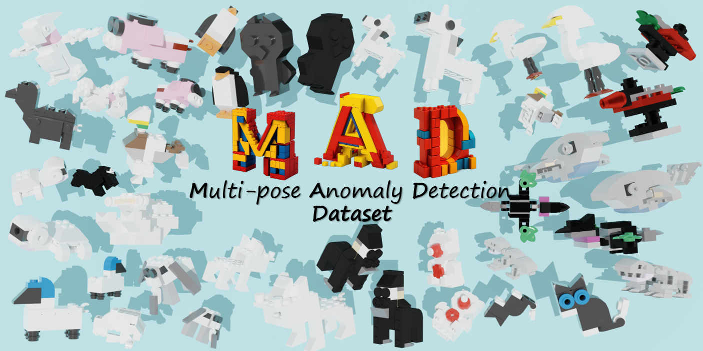
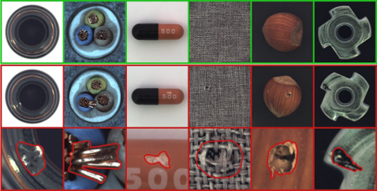
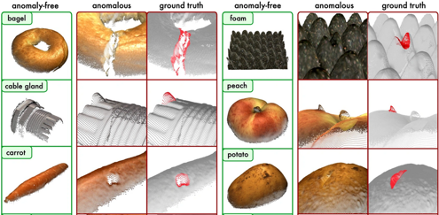
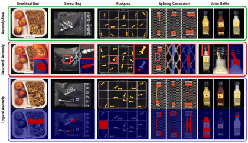
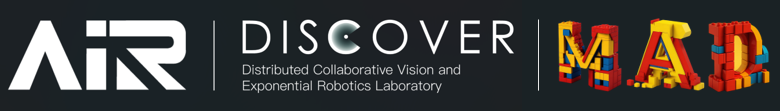
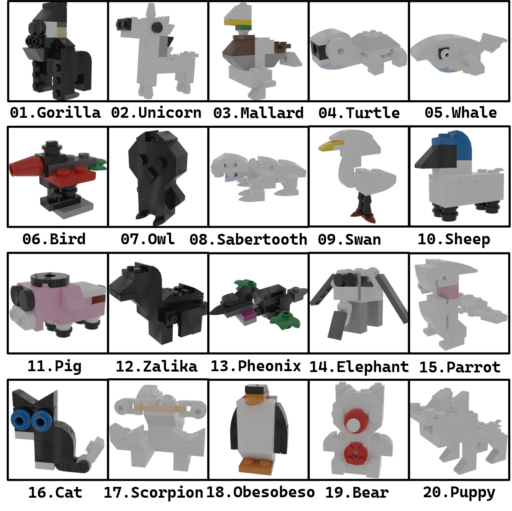
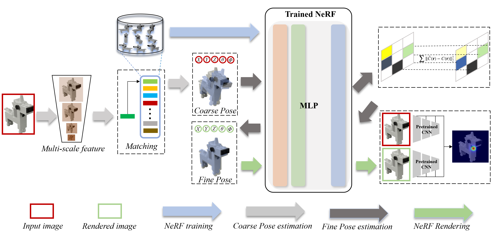

# PAD (NeurlPS'23 D&B Track, Submission): Official Project Repository   
This repository provides the official PyTorch implementation code, data and models of the following paper:  
**PAD: A Dataset and Benchmark for Pose-agnostic Anomaly Detection**<br>
> [Qiang Zhou](https://scholar.google.com/citations?user=CMYTxUEAAAAJ&hl=en)* (AIR), [Weize Li](https://ericlee0224.github.io/)* (AIR), [Lihan Jiang](https://github.com/jianglh-WHU)  (WHU), [Guoliang Wang](https://github.com/Cross-ZBuild) (AIR)   
> [Guyue Zhou](https://air.tsinghua.edu.cn/en/info/1046/1196.htm) (AIR), [Shanghang Zhang](https://www.shanghangzhang.com/) (PKU), [Hao Zhao](https://sites.google.com/view/fromandto) (AIR). <br>

**Abstract:** 
*Object anomaly detection is an important problem in the field of machine vision and has seen remarkable progress recently. However, two significant challenges hinder its research and application. First, existing datasets lack comprehensive visual information from various pose angles. They usually have an unrealistic assumption that the anomaly-free training dataset is pose-aligned, and the testing samples have the same pose as the training data. However, in practice, anomaly can come from different poses and training and test samples may have different poses, calling for the study on pose-agnostic anomaly detection. Second, the absence of a consensus on experimental settings for pose-agnostic anomaly detection leads to unfair comparisons of different methods, hindering the research on pose-agnostic anomaly detection. To address these issues, we introduce Multi-pose Anomaly Detection (MAD) dataset and Pose-agnostic Anomaly Detection (PAAD) benchmark, which takes the first step to address the pose-agnostic anomaly detection problem. Specifically, we build MAD using 20 complex-shaped LEGO toys including 4k views with various poses, and high-quality and diverse 3D anomalies in both simulated and real environments. Additionally, we develop the PAAD framework, trained using MAD, specifically designed for pose-agnostic anomaly detection. Through comprehensive evaluations, we demonstrate the superiority of our dataset and framework. Furthermore, we provide an open-source benchmark library, including dataset and baseline methods which cover 8 anomaly detection paradigms, to facilitate future research and application in this domain.*<br>

<p align="center">
  
</p>

## 0. Pose-agnostic Anomaly Detection Setting
The progress of object anomaly detection in industrial vision is significantly impeded by the scarcity of datasets containing high-quality annotated anomaly samples and comprehensive view information about normal objects. 

**MVTec** has developed a series of widely-used photo-realistic industrial anomaly detection datasets：
**All IMGs from MVTec.**  
However, the objects provided by the [**MVTec-AD**](https://www.mvtec.com/company/research/datasets/mvtec-ad) dataset are overly simplistic, as discerning anomalies can be achieved solely from a single view. 

<p align="center">
  
</p>

Although the [**MVTec 3D-AD**](https://www.mvtec.com/company/research/datasets/mvtec-3d-ad) dataset offers more complex objects, it lacks RGB information from a full range of views, requiring the supplementation of hard-to-capture point cloud data to detect invisible structural anomalies. 

<p align="center">
  
</p>

The [**MVTec-LOCO AD**](https://www.mvtec.com/company/research/datasets/mvtec-loco) dataset provides rich global structural and logical information but is not suitable for fine-grained anomaly detection on individual objects.

<p align="center">
  
</p>

[**GDXray**](https://github.com/computervision-xray-testing/GDXray) provides grayscale maps obtained through X-ray scans for visual discrimination of structural defects but lacks normal samples and color/texture information.

The [**MPDD**](https://ieeexplore.ieee.org/document/9631567) dataset offers multi-angle information about the objects but is limited in size and lacks standardized backgrounds in the photos.

Recently, **Eyecandies** has introduced a substantial collection of synthetic candy views captured under various lighting conditions and provides multimodal object information. However, there remains a significant gap between laboratory-synthesized data and the real or simulated data domain.

To address these issues and enable exploration of the pose-agnostic AD problem, we propose our dataset. In Table shown as below, we present a comprehensive comparison between MAD and other representative object anomaly detection datasets.
<p align="center">
  
</p>

---
## 1. MAD: Multi-pose Anomaly Detection Dataset.
Each category comprises a set of defect-free training images (*w* pose information) and a test set of images (*w/o* pose information) with various kinds of defects as well as images without defects.
<p align="center">
  
</p>  

### 1.1 Meet ours 20 toys
<p align="center">
  
</p>

### 1.2 MAD-Simulated Set
MAD-Sim Dataset (972M): [Download from here](https://drive.google.com/file/d/1sa7tl84K0lNhJoa8WCH3yiVEhkWP5sLp/view?usp=sharing).
#### Data Directory
```
MAD-Sim
 └ 01Gorilla
   └ train
     └ good
       └ 0.png
       └ 1.png
   └ test  
     └ Burrs
       └ 0.png
     └ Missing
     └ Stains
     └ good
   └ ground_truth
     └ Burrs
       └ 0_mask.png
     └ Missing
     └ Stains
   └ transforms.json
 └ 02Unicorn
```

### MAD-Real Set

### License
<a rel="license" href="http://creativecommons.org/licenses/by-nc-sa/4.0/"></a><br />MAD Dataset is licensed under a <a rel="license" href="http://creativecommons.org/licenses/by-nc-sa/4.0/">Creative Commons Attribution-NonCommercial-ShareAlike 4.0 International License</a>.  
You are free to use, copy, and redistribute the material for non-commercial purposes provided you give appropriate credit, provide a link to the license, and indicate if changes were made. If you remix, transform, or build upon the material, you must distribute your contributions under the same license as the original. You may not use the material for commercial purposes.  


---
## 2. Anomaly Detection and Localization Benchmark on MAD.
### 2.1 Overview of benchmarking methods   
The selection criteria for benchmark methods include representativeness, superior performance, and availability of source code. To comprehensively investigate the performance of anomaly detection algorithms in the pose-agnostic anomaly detection setting, we selected 1-2 representative methods from each of the eight anomaly detection paradigms:  
**Feature embedding-based methods:** <br>
*Teacher-Student Architecture* - [STFPM] https://github.com/gdwang08/STFPM  
*One-Class Classification (OCC)* - [Cutpaste] https://github.com/LilitYolyan/CutPaste  
*Distribution-Map* - [Fastflow][CFlow] https://github.com/openvinotoolkit/anomalib/tree/main/src/anomalib/models  
*Memory Bank* - [Patchcore] https://github.com/amazon-science/patchcore-inspection  
**Reconstruction-based methods:** <br>
*Autoencoder (AE)* - [DRAEM]https://github.com/openvinotoolkit/anomalib/tree/main/src/anomalib/models  [FAVAE] https://github.com/xiahaifeng1995/FAVAE-anomaly-detection-localization-master  
*Generative Adversarial Networks (GANs)* - [OCR-GAN] https://github.com/zhangzjn/OCR-GAN  
*Transformer* - [UniAD] https://github.com/zhiyuanyou/UniAD  
**Pseudo-anomaly methods:** <br>
[Cutpaste] https://github.com/LilitYolyan/CutPaste  
[DRAEM]https://github.com/openvinotoolkit/anomalib/tree/main/src/anomalib/models  
### 2.2 Results (Pixel/Image-AUROC)
| Category   | **Feature Embedding-based** |            |            |            |            |          | **Reconstruction-based** |            |         |            | Ours               |
| :--------: | :-------------------------: | :--------: | :--------: | :--------: | :--------: | :------: | :----------------------: | :--------: | :-----: | :--------: | :----------------: |
|            | Patchcore                   | STFPM      | Fastflow   | CFlow      | CFA        | Cutpaste | DREAM                    | FAVAE      | OCRGAN  | UniAD      | PAAD                   |
| Gorilla    | 88\.4/66.8                  | 93\.8/65.3 | 91\.4/51.1 | 94\.7/69.2 | 91\.4/41.8 | 36\.1/-  | 77\.7/58.9               | 92\.1/46.8 | 94\.2/- | 93\.4/56.6 | **99\.5/**93.6**** |
| Unicorn    | 58\.9/92.4                  | 89\.3/79.6 | 77\.9/45.0 | 89\.9/82.3 | 85\.2/85.6 | 69\.6/-  | 26\.0/70.4               | 88\.0/68.3 | 86\.7/- | 86\.8/73.0 | **98\.2/**94.0**** |
| Mallard    | 66\.1/59.3                  | 86\.0/42.2 | 85\.0/72.1 | 87\.3/74.9 | 83\.7/36.6 | 40\.9/-  | 47\.8/34.5               | 85\.3/33.6 | 88\.9/- | 85\.4/70.0 | **97\.4/**84.7**** |
| Turtle     | 77\.5/87.0                  | 91\.0/64.4 | 83\.9/67.7 | 90\.2/51.0 | 88\.7/58.3 | 77\.2/-  | 45\.3/18.4               | 89\.9/82.8 | 76\.7/- | 88\.9/50.2 | **99\.1/**95.6**** |
| Whale      | 60\.9/**86.0**              | 88\.6/64.1 | 86\.5/53.2 | 89\.2/57.0 | 87\.9/77.7 | 66\.8/-  | 55\.9/65.8               | 90\.1/62.5 | 89\.4/- | 90\.7/75.5 | **98\.3/82.5**     |
| Bird       | 88\.6/82.9                  | 90\.6/52.4 | 90\.4/76.5 | 91\.8/75.6 | 92\.2/78.4 | 71\.7/-  | 60\.3/69.1               | 91\.6/73.3 | 99\.1/- | 91\.1/74.7 | **95\.7/**92.4**** |
| Owl        | 86\.3/72.9                  | 91\.8/72.7 | 90\.7/58.2 | 94\.6/76.5 | 93\.9/74.0 | 51\.9/-  | 78\.9/67.2               | 96\.7/62.5 | 90\.1/- | 92\.8/65.3 | **99\.4/**88.2**** |
| Sabertooth | 69\.4/76.6                  | 89\.3/56.0 | 88\.7/70.5 | 93\.3/71.3 | 88\.0/64.2 | 71\.2/-  | 26\.2/68.6               | 94\.5/82.4 | 91\.7/- | 90\.3/61.2 | **98\.5/**95.7**** |
| Swan       | 73\.5/75.2                  | 90\.8/53.6 | 89\.5/63.9 | 93\.1/67.4 | 95\.0/66.7 | 57\.2/-  | 75\.9/59.7               | 87\.4/50.6 | 72\.2/- | 90\.6/57.5 | **98\.8/**86.5**** |
| Sheep      | 79\.9/89.4                  | 93\.2/56.5 | 91\.0/71.4 | 94\.3/80.9 | 94\.1/86.5 | 67\.2/-  | 70\.5/59.5               | 94\.3/74.9 | 98\.9/- | 92\.9/70.4 | **97\.7/**90.1**** |
| Pig        | 83\.5/85.7                  | 94\.2/50.6 | 93\.6/59.6 | 97\.1/72.1 | 95\.6/66.7 | 52\.3/-  | 65\.6/64.4               | 92\.2/52.5 | 93\.6/- | 94\.8/54.6 | **97\.7/**88.3**** |
| Zalika     | 64\.9/68.2                  | 86\.2/53.7 | 84\.6/54.9 | 89\.4/66.9 | 87\.7/52.1 | 43\.5/-  | 66\.6/51.7               | 86\.4/34.6 | 94\.4/- | 86\.7/50.5 | **99\.1/**88.2**** |
| Pheonix    | 62\.4/71.4                  | 86\.1/56.7 | 85\.7/53.4 | 87\.3/64.4 | 87\.0/65.9 | 53\.1/-  | 38\.7/53.1               | 92\.4/65.2 | 86\.8/- | 84\.7/55.4 | **99\.4/**82.3**** |
| Elephant   | 56\.2/78.6                  | 76\.8/61.7 | 76\.8/61.6 | 72\.4/70.1 | 77\.8/71.7 | 56\.9/-  | 55\.9/62.5               | 72\.0/49.1 | 91\.7/- | 70\.7/59.3 | **99\.0/**92.5**** |
| Parrot     | 70\.7/78.0                  | 84\.0/61.1 | 84\.0/53.4 | 86\.8/67.9 | 83\.7/69.8 | 55\.4/-  | 34\.4/62.3               | 87\.7/46.1 | 66\.5/- | 85\.6/53.4 | **99\.5/**97.0**** |
| Cat        | 85\.6/78.7                  | 93\.7/52.2 | 93\.7/51.3 | 94\.7/65.8 | 95\.0/68.2 | 58\.3/-  | 79\.4/61.3               | 94\.0/53.2 | 91\.3/- | 93\.8/53.1 | **97\.7/**84.9**** |
| Scorpion   | 79\.9/82.1                  | 90\.7/68.9 | 74\.3/51.9 | 91\.9/79.5 | 92\.2/91.4 | 71\.2/-  | 79\.7/83.7               | 88\.4/66.9 | 97\.6/- | 92\.2/69.5 | **95\.9/**91.5**** |
| Obesobeso  | 91\.9/89.5                  | 94\.2/60.8 | 92\.9/67.6 | 95\.8/80.0 | 96\.2/80.6 | 73\.3/-  | 89\.2/73.9               | 92\.7/58.2 | 98\.5/- | 93\.6/67.7 | **98\.0/**97.1**** |
| Bear       | 79\.5/84.2                  | 90\.6/60.7 | 85\.0/72.9 | 92\.2/81.4 | 90\.7/78.7 | 68\.8/-  | 39\.2/76.1               | 90\.1/52.8 | 83\.1/- | 90\.9/65.1 | **99\.3/**98.8**** |
| Puppy      | 73\.3/65.6                  | 84\.9/56.7 | 80\.3/59.5 | 89\.6/71.4 | 82\.3/53.7 | 43\.2/-  | 45\.8/57.4               | 85\.6/43.5 | 78\.9/- | 87\.1/55.6 | **98\.8/**93.5**** |
| Mean       | 74\.7/78.5                  | 89\.3/59.5 | 86\.1/60.8 | 90\.8/71.3 | 89\.8/68.2 | 59\.3/-  | 58\.0/60.9               | 89\.4/58.0 | 88\.5/- | 89\.1/62.2 | **97\.8/**90.9**** |

---
## 3. PAAD: Pose-agnostic Anomaly Detection Framework

<p align="center">
  
</p>

### Installation

To start, we recommend you to create an environment using conda:

```
conda create -n pad python=3.8
conda activate pad
```

Clone the repository and install dependencies:

```
git clone https://github.com/jianglh-WHU/PAAD.git
cd inerf
pip install -r requirements.txt
```

### How to use

### Train

First, you should download our MAD-Sim dataset, just from [here](https://drive.google.com/file/d/1S1rYgPyxFjCuLf1Z-JLyfS2lka4_pykf/view) and put the downloaded folder in the "data/MAD-Sim" folder

```
├── data 
│   ├── MAD-Sim  
```

To run the algorithm on *9(Gorilla)* object

```python
python anomaly_nerf_lego.py --config configs/LEGO-3D/9.txt --class_name 9
```

All other parameters such as *batch size*, *class_name*, *dataset_type* you can adjust in corresponding config [files](https://github.com/jianglh-WHU/PAAD/tree/main/configs/LEGO-3D).

All NeRF models were trained using this code https://github.com/yenchenlin/nerf-pytorch/

You can use our ckpts on MAD-Sim in [ckpts](https://github.com/jianglh-WHU/PAAD/tree/main/ckpts/LEGO-3D)

And iNeRF using the code https://github.com/salykovaa/inerf

### Evaluate

The test script requires the --obj arguments

```
python auroc_metric_feature.py --obj 9
```
### License
Code is open-source under an MIT License.   

---
### Contact Us
If you have any problem with our work, please feel free to contact:    
[MAD Dataset] bamboosdu@gmail.com or liweize0224@gmail.com  
[PAAD Code] mr.lhjiang@gmail.com
